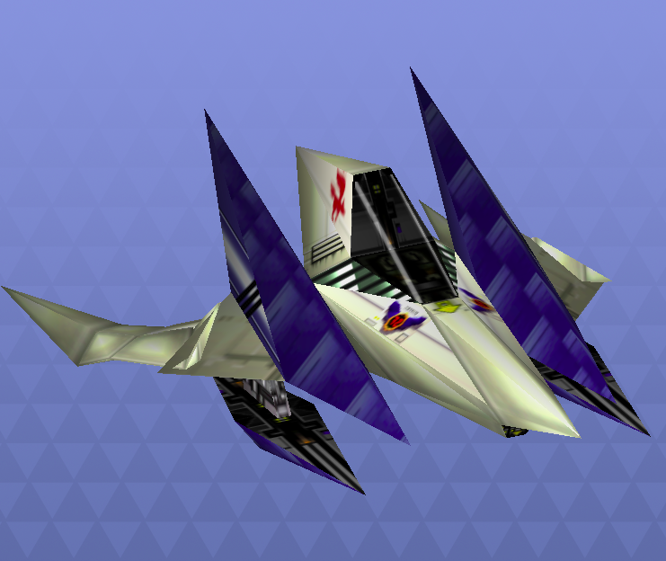
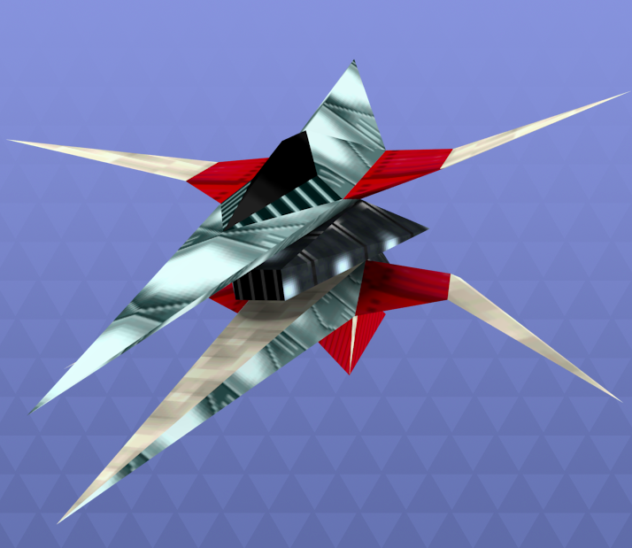

# StarFoxJs

- Daniel Charua
- Luis Barajas

## Propuesta de proyecto Final de gráficas computaciónales.

Vamos a replicar un nivel del juego de nintendo 64, Starfox. En éste el jugador principal va a ser la nave de Starfox en tercera persona baja. El objetivo principal es sobrevivir a los enemigos mientras se hace el mayor puntaje posible.

### Controles
La nave será controlada con el mouse con la posibilidad de moverte en X y Y, la nave dispara haciendo click en con el mouse.

### Modo de juego
El modo de juego sera infinty runner, en el cual el jugador tiene vida finita pero el mapa es infinito, va incrementando la dificultad al avanzar el nivel, existiran diferentes tipos de enemigos, con movimientos y poderes distintos, asi como obstaculos que deberan ser evitados. El jugador tendra un score basando en los enemigos destruidos y los power ups adquiridos.
#### Jugador

#### Enemigos y obstaculos
La escena sera en el espacio con distintas naves enemigas y obstaculos.

### Aspectos tecnicos
Se ocuparan colliders para detectar los disparos, destruir los objetos y enemigos. 

#### Librerías adicionales a usar
- [Threejs-fps-controls](https://github.com/JamesMilnerUK/threejs-fps-controls)
- [PointerLockControls](https://github.com/mrdoob/three.js/blob/master/examples/js/controls/PointerLockControls.js)
- SFX Class
- Tween

### Assets 
[link](https://www.models-resource.com/nintendo_64/starfox64/)

### Avances 2
- ~~Agragr música de fondo~~
- 2 tipos de powerups:
  1. Liefe 
      - ~~Te da 10 puntos de vida~~
      - ~~Agregar efectos cuando se active~~
  3. Ring 
      - ~~Te da 10 puntos de score~~
      - ~~Agregar efectos cuando se active~~
- Agregar asteriodes
  - Daño choque con jugador: 10 puntos
- 3 tipos de enemigos: 
  1. Enemigo fácil
      - ~~Va recto~~
      - ~~Vida: 2 balas~~
      - ~~Daño choque a jugador: 20 puntos~~
      - ~~Score: le da 2 puntos~~
  2. Enemigo medio
      - ~~Se mueve hacia el jugador~~
      - ~~Vida: 1 bala~~
      - ~~Daño choque a jugador: 20 puntos~~
      - ~~Score: le da 5 puntos~~
  3. Enemigo difícil
      - ~~Evade y te dispara~~
      - ~~Vida: 1 bala~~
      - ~~Daño choque a jugador: 20 puntos~~
      - ~~Daño bala: 2 puntos~~
      - ~~Score: le da 10 puntos~~
- amentando la dificultad con el tiempo
- ~~100 de vida~~
- ~~interfaz con menu~~